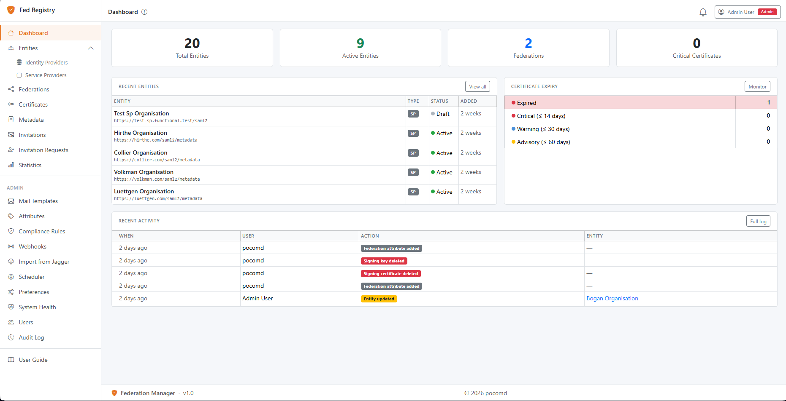

# Federation Manager

A modern SAML2 federation registry for National Research and Education Networks, built as a drop-in replacement for legacy Jagger (ResourceRegistry3).



---

## Features

- **Entity management** — register and manage IdPs and SPs with full SAML2 metadata field support
- **Metadata pipeline** — generates schema-valid, RSA-SHA256 signed XML using xmlsectool or SoftHSM2 PKCS#11 token; per-federation signing keys managed via UI; MDQ endpoint included
- **REFEDS compliance** — 15 automated checks against SAML2 spec, eduGAIN profile, Baseline Expectations, SIRTFI, CoC v2, and R&S
- **Certificate monitoring** — four-level expiry tracking (critical/warning/advisory/info) with email alerts
- **Federation workflow** — membership requests, approval/rejection with reason, multi-federation support
- **Webhooks** — configurable HTTP endpoints receive real-time events on entity approval, metadata generation, and more
- **Audit log** — immutable history of all changes to entities and federations
- **Roles & permissions** — Admin, Federation Manager, Entity Manager, and Guest with 26 granular permissions
- **Dual authentication** — local email/password always available; optional SAML2 SSO via SimpleSAMLphp with auto-provisioning on first login and configurable default role and attribute mapping
- **Web installer** — 5-step browser wizard sets up DB, mail, and admin account; no CLI required

## Technology

| Layer | Choice |
|---|---|
| Framework | Laravel 13 / PHP 8.4 |
| Frontend | Livewire 4, Bootstrap 5, Alpine.js |
| Database | MySQL 8 |
| Cache / Queues | Redis 7, Laravel Horizon |
| XML signing | xmlsectool 3 (RSA-SHA256) |
| HSM | SoftHSM2 / PKCS#11 (optional) |
| Authentication | SimpleSAMLphp |

## Quick start

1. Clone and set ownership:
   ```bash
   git clone https://github.com/pocomd/federations-manager.git /var/www/federations-manager
   sudo chown -R www-data:www-data /var/www/federations-manager   # nginx on CentOS
   ```

2. Point your web server at `public/` — see [docs/install.md §5](docs/install.md#5-web-server) for the Nginx config.

3. Open the app URL in a browser. The **pre-installer** launches automatically, checks requirements, and installs Composer and npm dependencies with a single button click.

4. Follow the **5-step wizard** (database → mail → admin account → finish).

5. Start the queue worker:
   ```bash
   sudo cp deploy/federations-management.service /etc/systemd/system/
   sudo systemctl enable --now federations-management
   ```

See **[docs/install.md](docs/install.md)** for full server setup (PHP, MySQL, Redis, Nginx, xmlsectool, SimpleSAMLphp).

## Documentation

| Document | Audience |
|---|---|
| [docs/install.md](docs/install.md) | System administrators — full server setup guide |
| [docs/operations-guide.md](docs/operations-guide.md) | System administrators — day-to-day operations reference |
| [docs/user-guide.md](docs/user-guide.md) | Federation operators — day-to-day usage |
| [docs/deployment-checklist.md](docs/deployment-checklist.md) | Pre-go-live checklist |
| [docs/simplesamlphp-deployment.md](docs/simplesamlphp-deployment.md) | SAML authentication setup |
| [docs/validation-rules.md](docs/validation-rules.md) | Developers — adding and editing compliance rule classes |

## Standards

- OASIS SAML Metadata 2.0
- REFEDS Baseline Expectations v1, Research & Scholarship v1.3, Code of Conduct v2, SIRTFI v1/v2, MFA Profile v1.2
- eduGAIN Metadata Profile
- Metadata Query Protocol (MDQ / draft-young-md-query)
- mdrpi:RegistrationInfo (SAML V2.0 Metadata Extensions)

## Built with

This project was developed with the assistance of [Claude](https://claude.ai) by Anthropic.

## License

MIT — Copyright (c) 2026 pocomd
